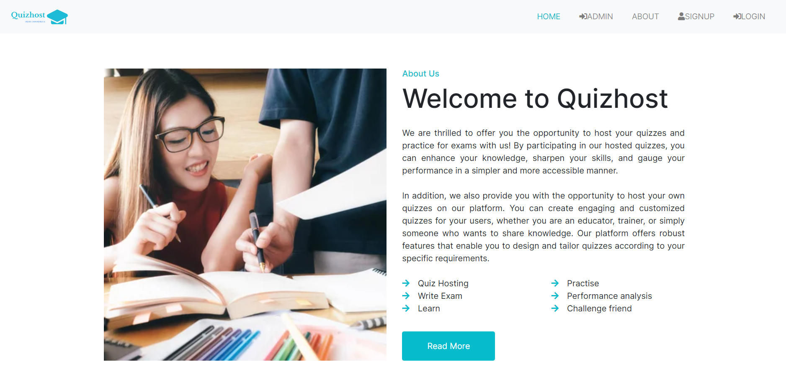
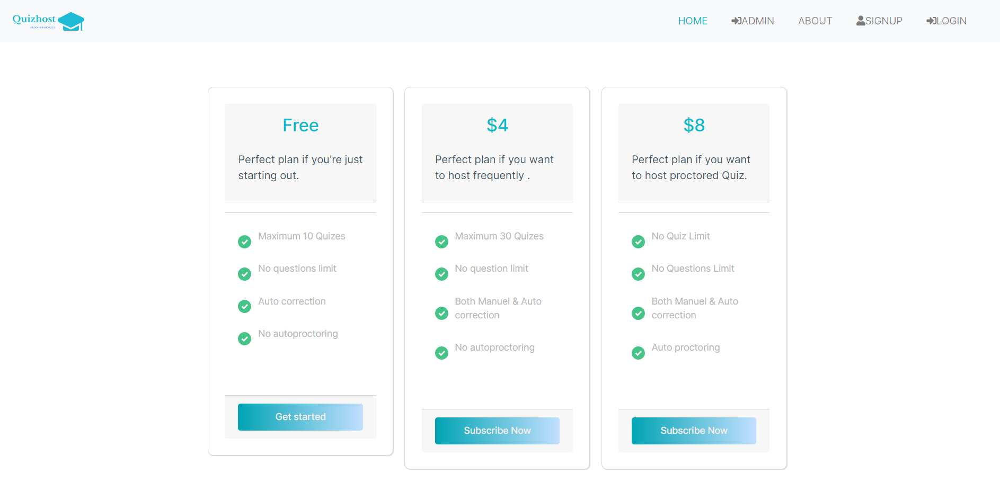

# Quizhost - Quiz Hosting Web Application

## Overview

Quizhost is an interactive web platform that brings the thrill of quizzes to your fingertips. Engage in a diverse selection of exciting quizzes on various topics, challenge your knowledge, and compete with others to claim the top spot on the leaderboard.Host your quizzes with ease, craft intriguing questions, and create a captivating quiz experience for your audience.

Built using HTML, CSS, Bootstrap, Java Servlets, JSP, and MySQL, Quizhost ensures a smooth and intuitive user experience. Responsive design allows you to enjoy the excitement of quizzing across devices.

Join Quizhost now and immerse yourself in a world of fun, learning, and healthy competition. Start your quizzing journey today! 🚀🏆

## Features

### Quiz Participation 🏆

Dive into a wide range of exciting quizzes on various topics. Put your knowledge on the test and compete with others to claim the top spot on the leaderboard.

### Quiz Hosting 🎯

Take the reins as a quizmaster and create your quizzes. Craft intriguing questions, set the difficulty level, and delight your participants with a thrilling quiz experience.

### Seamless Integration with PayPal 💳

Secure and convenient payment processing with PayPal integration ensures smooth transactions for premium services of quiz hosting. Enjoy hassle-free payments for your quiz endeavors.

## Key Technologies

- **Frontend**: HTML, CSS, and Bootstrap - A visually appealing and responsive user interface that works seamlessly across devices.

- **Backend**: Java Servlets and JSP - A robust backend powering the application's logic and handling user interactions.

- **Database**: MySQL - A powerful and reliable database management system for storing quiz data and user information.
  
- **IDE**: NetBeans - A feature-rich integrated development environment used for the development of Quizhost.
  

## Prerequisites

- JDK 17 or above is required to run this application.
- Download XAMPP and create the necessary tables in phpMyAdmin as the database used is MySQL.
- The following JAR files are required:
  - mysql-connector-java-8.0.30.jar
  - jakarta.servlet.jsp.jstl-2.0.0.jar
  - javax.mail.jar
  - activation-jaf1.1.1.jar
  - json-20230227.jar
  - paypal-core-1.6.2.jar
  - paypalhttp-2.0.0.jar
  - checkout-sdk-2.0.0.jar
  - tomcat-servlet-api-9.0.76.jar

## Getting Started

1. Clone the repository to your local machine.
2. Set up the required JAR files in your project's classpath.
3. Configure your MySQL database using XAMPP and create the necessary tables using phpMyAdmin.
4. Deploy the application on a Tomcat 10.0.23 server.

## Google Email Server Integration

Quizhost leverages the powerful Google Email Server to send email notifications to users. The integration process involves the following steps:

1. **Create a Google API Project**: Create a new project on the [Google Cloud Console] (https://console.cloud.google.com/) and enable the Gmail API for the project.

2. **Generate API Credentials**: Generate API credentials (OAuth 2.0 client ID) for the project, specifying the appropriate OAuth consent screen settings.

3. **Configure Email Sending**:  Use the OAuth 2.0 client ID and secret to authenticate the application.

By integrating with the Google Email Server, Quizhost ensures reliable and secure email delivery to keep participants informed about their upcoming quizzes and provide them with their results and answers after the quiz has ended.

## Screenshots

## Contributing

Contributions are welcome! If you find any issues or have suggestions for improvements, please open an issue or submit a pull request.

## Website

Visit our website: [Quizhost Online](http://quizhost.online)

Explore a world of exciting quizzes and seamless hosting experience! Join now and embark on a quizzing adventure like never before.

---

*Quizhost: Your Gateway to Quizzing Adventure!* 🚀🌟

